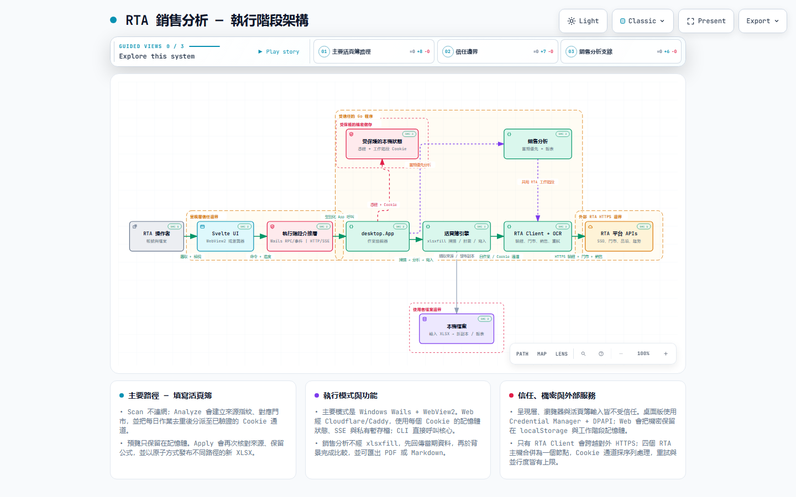
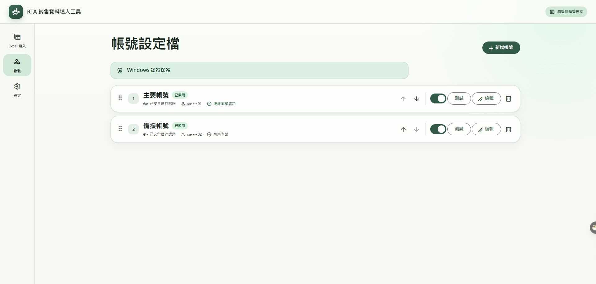
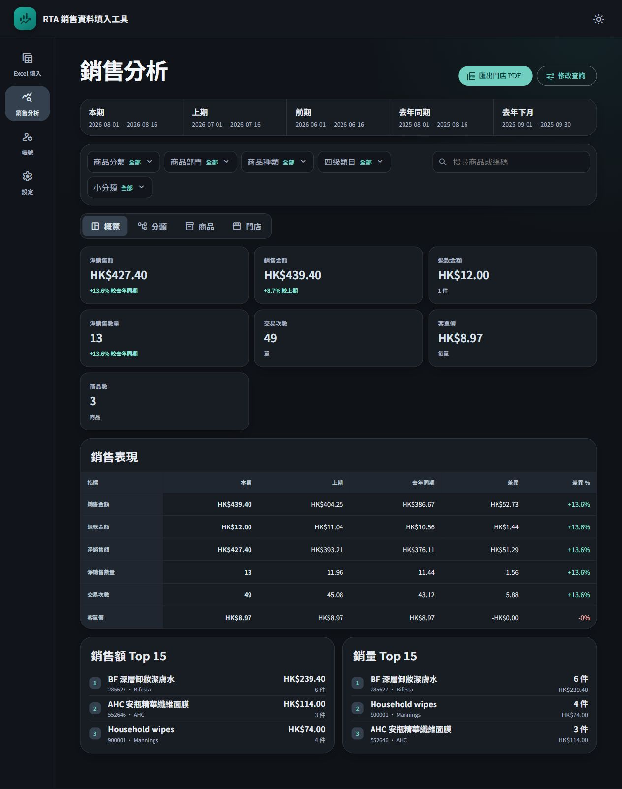
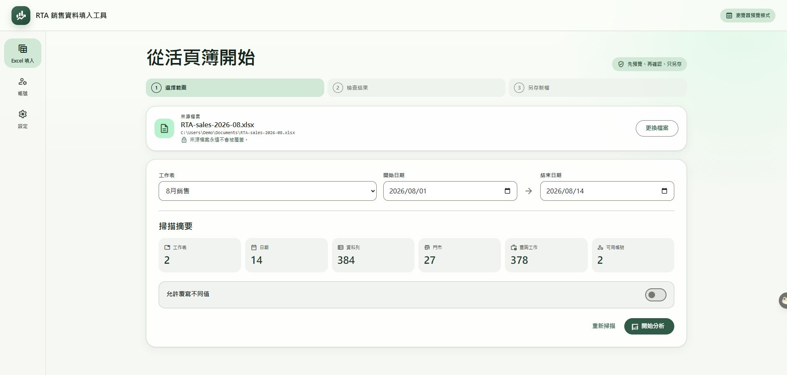
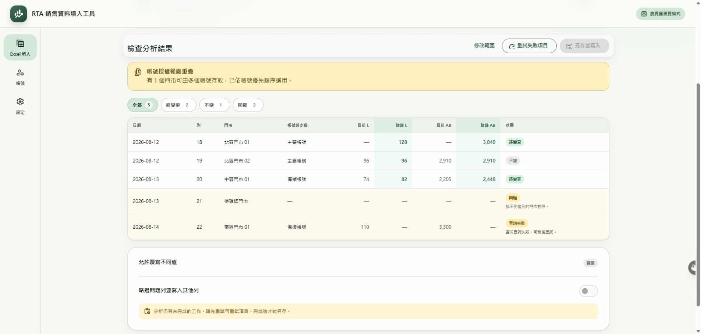
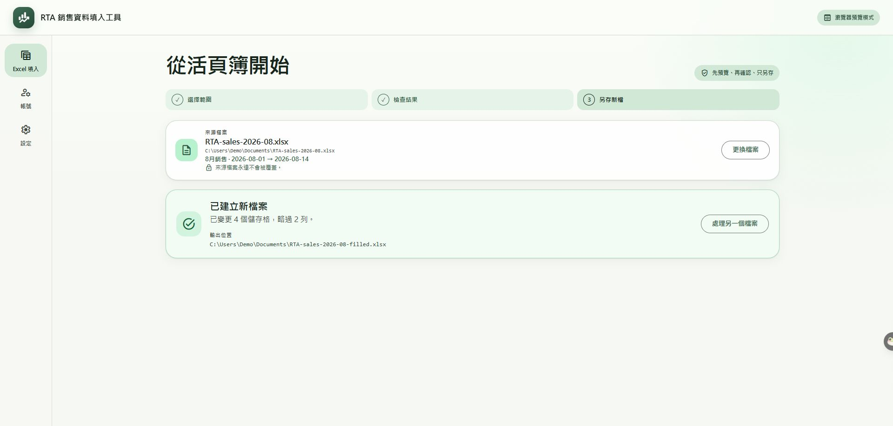

# RTA 銷售分析 (RTA Sales Analyzer)

English | [繁體中文](README.zh-TW.md)

**RTA 銷售分析** (English name: **RTA Sales Analyzer**) is a desktop application for reviewing store sales, exporting PDF reports, and writing figures into the company's Excel workbook. A live web edition is at [rtasales.com](https://rtasales.com). Windows is the supported desktop; Linux and macOS desktop builds are also published.

After installation, the application is operated with the mouse. Programming knowledge and command-line use are not required.

The application can:

1. **Sign in to RTA** and complete the captcha automatically
2. **Display store sales**, compared with the previous month and the same month of the previous year
3. **Export PDF reports** (one combined report and one report per store, suitable for meetings)
4. **Write the day's sales amount and transaction count** into the company's existing Excel workbook

The Start menu shortcut is named **RTA 銷售分析**.  
The supported distribution is `RTA-Excel-Filler-portable.exe` (Windows 64-bit, no installer). Historical releases remain unchanged.

---

## What's new in 0.4.7

Update controls now match the existing desktop Settings UI: version badges, switches, primary/secondary actions, collapsible release notes and a redesigned confirmation dialog, with light/dark and narrow-screen support.

[Release notes and screenshots (Traditional Chinese)](docs/releases/v0.4.7.zh-TW.md). Users of 0.4.6 can upgrade from Settings → Check for updates.

## Updates introduced in 0.4.6

GitHub Releases now powers in-app update checks, release notes and explicitly confirmed, verified downloads with backup and restart. Startup checks can be disabled; downloads never start automatically. Future Windows releases are portable-only, with no separate update server.

**Users of 0.4.5 and older must first download 0.4.6 manually.** Close the old app, retain a backup and replace it at the same path and filename to preserve settings. Subsequent upgrades can use the in-app updater.

[Release notes and update screenshots (Traditional Chinese)](docs/releases/v0.4.6.zh-TW.md). Those screenshots show the earlier isolated signed fixture pair, not the final 0.4.7 UI.

## Runtime architecture

Explore the repository's high-level runtime architecture, primary workbook path, external RTA dependencies, and trust boundaries.

[Open the interactive runtime architecture diagram (Traditional Chinese)](https://miku0139oao.github.io/rta-sales-client-go/)

---

## Requirements

- **Windows 10 or 11 (64-bit)** for the supported desktop, or the web edition in a current browser
- A network connection that can reach RTA
- One or more RTA accounts with access to the stores you need to review

Use the Windows portable executable. If Microsoft Edge WebView2 Runtime is missing, install it manually from Microsoft before launching.

---

## Install

1. Download the latest files from [Releases](https://github.com/Miku0139oao/rta-sales-client-go/releases).
2. Save **`RTA-Excel-Filler-portable.exe`** in a writable local folder. Verify its digital signature; do not bypass an invalid-signature warning.
3. Double-click the executable to launch **RTA 銷售分析**.

Only one window may run at a time. If a launch appears to do nothing, check the taskbar; the application may already be open.

A silent walkthrough with captions, updated for 0.4.4 filters and export:

[Tutorial video](https://github.com/Miku0139oao/rta-sales-client-go/releases/download/v0.4.4/RTA-Sales-Analyzer-tutorial.mp4)

A longer written guide (Traditional Chinese): [docs/tutorial.zh-TW.md](docs/tutorial.zh-TW.md)

### Other release files

| File | When to use it |
| --- | --- |
| `RTA-Excel-Filler-portable.exe` | Windows 64-bit, no installation. Requires [WebView2](https://developer.microsoft.com/microsoft-edge/webview2/) |
| `SHA256SUMS.txt` | Used by IT to verify that a file has not been altered. Everyday users may ignore it |

The release workflow stages unsigned Windows portable artifacts as a **draft only**. Signed publication requires explicit local validation with `scripts/publish-portable.ps1`; see [portable update safety and limitations](docs/portable-updates.md). Settings can check for newer stable releases (startup checks can be disabled); checks never download executables. Trusted signed Windows portable builds offer **Download and restart** after an explicit warning: finish/export your work first, because unsaved reports are lost on restart. Accounts/settings and the old executable backup are preserved. Development, unsigned or unsupported builds explain why installation is unavailable; update those manually with the app closed, preserving its path, filename and an old backup. An isolated signed fixture pair passed real Wails upgrade and settings-preservation checks. HTTP was fixture-backed; see the documented validation scope and limits.

---

## First launch: add an account

Open **Accounts** on the left, then choose **Add account**.

Complete the following fields:

- **Display name** — a label for your own use, such as “Main” or “North”
- **Account** — the RTA login
- **Password** — the RTA password

**Test and enable** is the recommended action. The application signs in to RTA, so the captcha and store access are verified.  
Disabled accounts are ignored by Sales analysis and Excel fill.

### If you have more than one account

The list order is the priority, from top to bottom.  
If two enabled accounts can access the same store, the account higher in the list is used.

Use **Move up** / **Move down** on each row to change the order.

Passwords are stored in Windows Credential Manager. They are not stored as plain text.  
Deleting an account also deletes its password.

---

## Sales analysis

Use this page to review a month, compare it with the previous year, and export PDFs.

1. Open **Sales analysis**.
2. Select an enabled account.
3. Select the stores (Select all is acceptable).
4. Choose a period:
   - **Month comparison** (the usual choice): select one month
   - **Date range**: set your own start and end dates
   - **Week comparison**: set a date range and compare matching weekdays; useful for weekend or fixed-weekday activity
5. Click **Run analysis** and wait for the query to finish.

### What a month comparison includes

If you select August, the application loads five periods:

| Label | Meaning |
| --- | --- |
| Current | The month you selected |
| Previous | The month before that |
| Two periods ago | The month before previous |
| Same month last year | August of the previous year |
| Following month last year | September of the previous year (useful when planning what to restock or promote next) |

If the selected month is still in progress, the first four periods end on today's day of the month, so the comparison remains aligned.  
On 16 August, previous ends on 16 July, and last year ends on 16 August of the previous year.  
Last year's following month is always the full month.

### After the query

- **Overview** — net sales, sales amount, returns, transactions, basket value, top products
- **Weekly** — how each week and store moved inside the current period
- **Focus** — products that sold well in last year's following month
- **Categories** — how each category moved across periods
- **Products** — line items; narrow them with the category filters or search
- **Store comparison** — each store's current, previous, and year-ago totals

Transactions and basket value are whole-store figures.  
If you filter to one category or one product, those two numbers are hidden, because the source has no figure at that grain.

### Export PDF and AI files

Click **Export PDF**. If category filters or search are active, the dialog defaults to **Use the current analysis filters** and lists what you selected.

- **PDF report** and **Export for AI analysis** share that same filter. You do not pick categories again.
- Choose **Ignore on-screen filters** if you want whole-store figures.
- The AI file is Markdown: drop it into any AI and it writes the report. No extra prompt.
- If you have item-code groups, the main PDF keeps a one-page summary per group unless you ask for a separate detailed PDF.

Pick a folder to write the files. If a name already exists, a number is added. **Existing files are not overwritten.**  
The full walkthrough is in [docs/tutorial.zh-TW.md](docs/tutorial.zh-TW.md).

---

## Fill numbers into Excel

Use this page for the company's daily workbook.  
The application writes only two columns, and it **always saves a new file. The original Excel file is never changed.**

The default sheet name is `Dairly` (that spelling is used in the actual workbook):

| Column | Contents |
| --- | --- |
| C | Store id |
| F | Date |
| L | That day's sales amount (sales less returns) |
| AB | That day's transaction count |

### Three steps

**1. Select the range**

- Click **Open Excel file**, or drop an `.xlsx` onto the window (`.xls` is not supported)
- Select the sheet and the inclusive dates
- Review the scan summary: store count, date count, and available accounts
- Click **Start analysis**

**2. Review the results**

Each row is marked:

- **Will change** — a new number will be written
- **Unchanged** — already matches RTA
- **Issue / Query failed** — this row will not be written until you resolve or skip it

**3. Save a copy**

When the preview is correct, click **Save and write** and choose where the new file should be saved.  
The success card shows the **file name** and **folder** separately.  
Click **Open file** to open it in Excel, or **Show in folder**.

### Before you write

- **The source file is never overwritten.**
- If a cell already contains a different number, turn on **Overwrite all differing values**, or those rows remain issues.
- Formula cells are left unchanged.
- If some queries fail, use **Retry failed items**.
- If you cancelled before sign-in finished, run **Start analysis** again.
- An unfinished analysis cannot be saved.
- To skip issue rows and write the rest: wait until analysis has finished, then turn on **Skip all issue rows and write the rest**. The application asks for confirmation.

If column C is not an RTA store id, enable the local mapping file in Settings (JSON or CSV). Do not share a mapping that contains real store codes.

---

## Settings

Open **Settings**.

| Setting | Typical use |
| --- | --- |
| Theme and language | Switch to Traditional Chinese, or change light / dark. **Applies immediately** — no Save click is required |
| Max jobs per run | Default 2,000. A very wide date range combined with many stores will stop at this limit |
| Query concurrency | Default 160, for one account querying many stores at once. If the network is unstable, try 32 or 8 |
| Local mapping | Required only if Excel store codes are not RTA store ids |

After changing workload or mapping settings, click **Save**.

---

## Frequently asked questions

**The application will not start, or the window flashes and disappears**  
Windows 10 and Windows 11 normally already include Edge WebView2. If it is missing, install [WebView2 Runtime](https://developer.microsoft.com/microsoft-edge/webview2/) manually; the portable app does not install system components.

**A second window closes immediately**  
This is expected. Only one instance can run.

**Account testing keeps failing on the captcha**  
Wait one minute and test again. If it still fails, confirm the password, and try signing in to RTA in a browser.

**Sales analysis reports that there are no stores**  
On Accounts, confirm that the profile is enabled and that the last test succeeded. Some logins genuinely have no store access.

**Many Excel rows report that the store could not be mapped**  
Column C does not match an RTA store id. Correct the workbook, or add a mapping file in Settings.

**Save reports that the source file changed**  
Do not edit the source workbook in Excel after analysis starts. Scan and analyze again.

**After uninstall, the accounts are still present on the next install**  
Uninstall retains accounts by design. To remove them, delete each profile on the Accounts page first.

**Are passwords stored securely?**  
They are stored by Windows Credential Manager. Sales figures and Excel previews remain in memory for the current session only.

---

## Data location

Saved accounts and encrypted login state are stored here (the folder still uses the previous product name, so existing data continues to load):

`C:\Users\<your user name>\AppData\Roaming\RTA Excel Filler`

You do not need to edit this folder. To remove all local data from a computer, delete every account in the application, then delete the folder.

---

## For developers

CLI usage, the Go library, and instructions for building from source are in [DEVELOPMENT.md](DEVELOPMENT.md).
